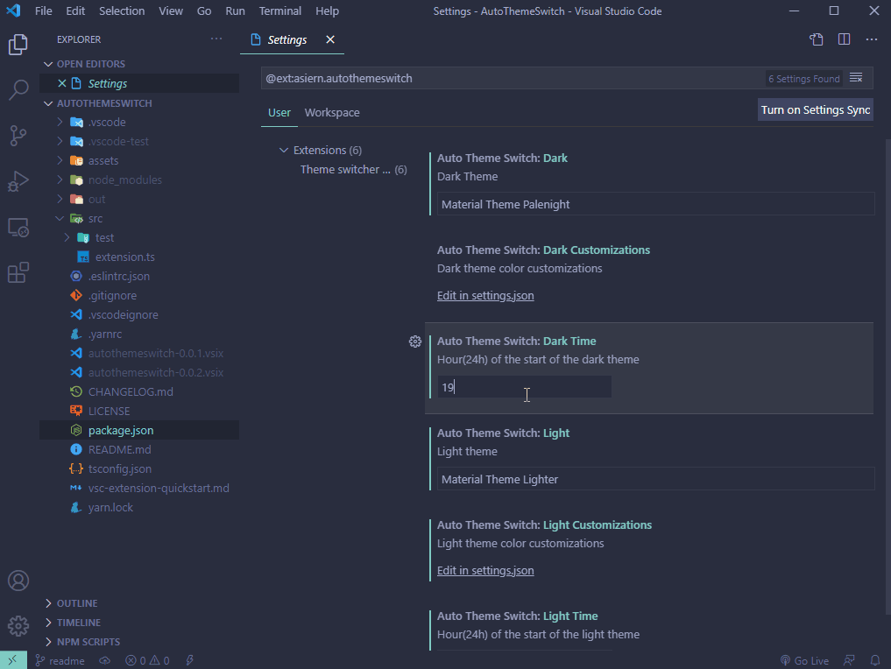

# AutoThemeSwitch

Automatically change between dark and light theme based on schedules.

## Extension Settings

- `AutoThemeSwitch: dark`

  Default Visual Studio Dark

  Dark Theme

- `AutoThemeSwitch: light`

  Default Visual Studio Light

  Light Theme

- `AutoThemeSwitch: darkCustomizations`

  Dark Theme color customizations

- `AutoThemeSwitch: lightCustomizations`

  Light Theme color customizations

- `AutoThemeSwitch: darkTime`

  Default 20:00

  Hour(24h) of the start of the dark theme. Format HH:MM.

- `AutoThemeSwitch: lightTime`

  Default 07:00

  Hour(24h) of the start of the light theme. Format HH:MM.
